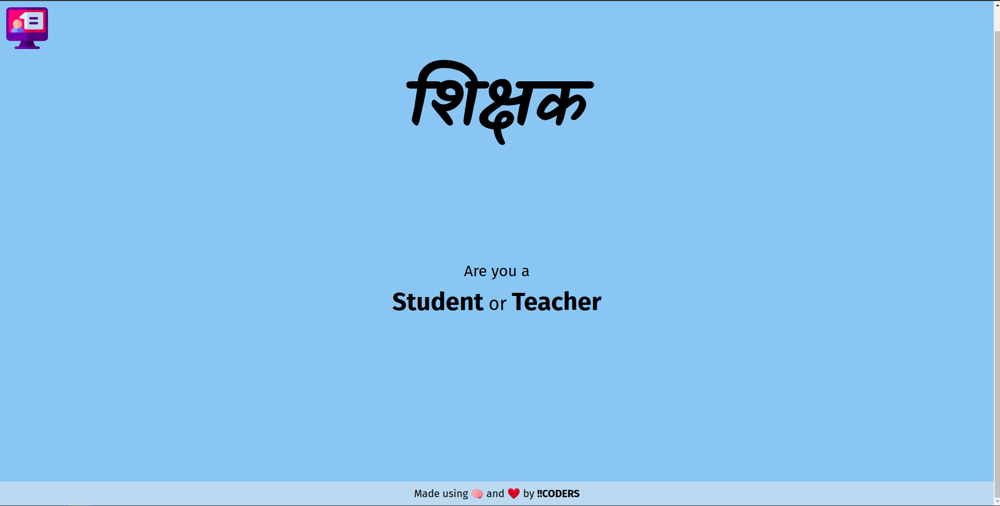
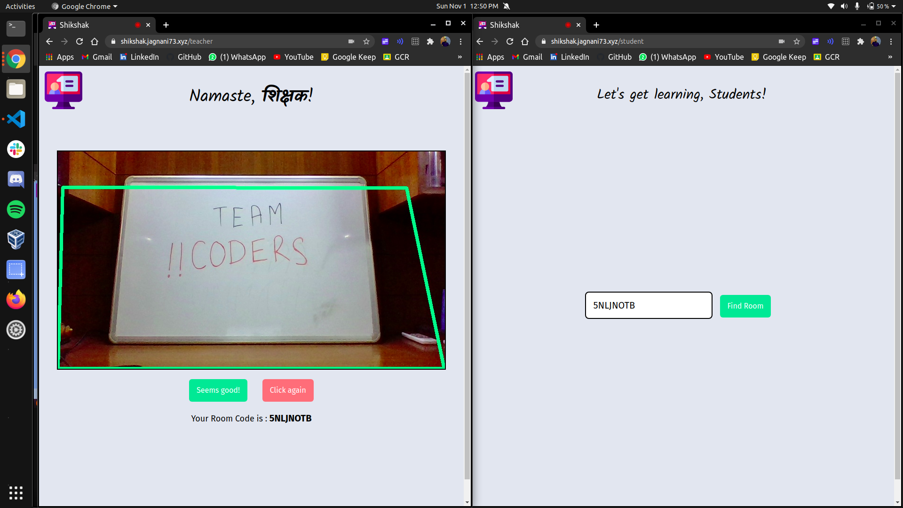
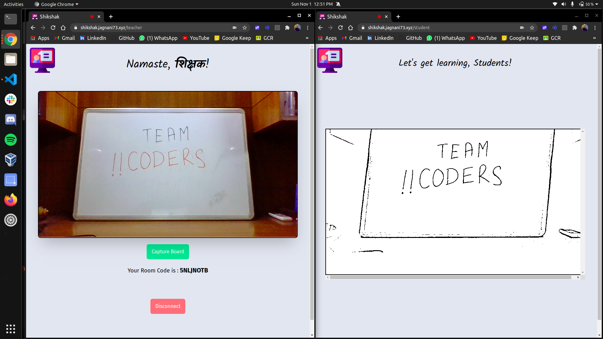

# **Shikshak** - HackThisFall'20

### Academics made Affordable.

---

## A Preview of What Shikshak Is:

## Landing page:

## Calibrating Board on Teacher's End

## Board Preview on the Students Canvas

## The problem Shikshak solves

> During this pandemic, the online classes and the work from home charades easily consume over 3GB of a person's network data. This might seem normal for a person middle-class or above, but the weekly cost of such a high bandwidth is not viable for everyone, especially for the ones looking for affordable education. This is where "Shikshak" helps the needy. We provide a low-bandwidth solution to attending online classes through our portal. The magic happens in how we transmit the image of the board on which the teacher is writing. We heavily compress it to the format such that there is almost an 85% decrease in internet consumption using our product. From the machine learning perspective following are some challenges we faced: detect corners of the blackboard, make a suitable boundary of the best-suited blackboard as understood by machine learning, define final edges of the blackboard, dot map the pixels to understand the written content on the blackboard.

## Challenges we ran into

> The major hurdle on the web development side was to configure webRTC in such a way so that students can only use an audio channel for real-time communication with the teacher. The second hurdle was to bring the frames of the teacher's video down to such a format so that net consumption can be decreased.

## Features offered by Shikshak

- ### **Corner Detection**
  - Using `opencv`, `imutils` to recognise end pooints of the board.
- ### **Edge Detection**
  - Combinations to figure out best possible board-frame and detecting its edges.
- ### **Pixel Mapping**
  - Using `canny` to transform image to first a Gaussian Blur, and eventually its pixels.
- ### **Real-time Audio Communication**
  - The Teacher is in constant contact with the Student(s) using `webRTC` audio channels.
- ### **Efficient & Real-time transmission of data**
  - Scanning of the board, generation of pixel array, and real-time transmission of this array via `Socket.IO` and plotting the pixels on the Students canvas using `Canvas API`.

## Technology Stack and Dependencies

- **ML**
  - numpy
  - imutils
  - opencv
  - pickle
  - canny
  - matplotlib
  - scipy.spatial
- **APIs**
  - Node.js
  - Express in TypeScript
  - Socket.IO
  - Flask
- **Front-end**
  - React.js in TypeScript-XML
  - Tailwind CSS
  - Socket.IO - Client
  - webRTC
  - Canvas API

# Thank You!

<h1 align="center"> Contributors </h1>
<table align="center">
<tr align="center">
<td>
<strong>Abhishek Saxena</strong>

</td>
<td>
<strong>Ansh Sharma</strong>

</td>
</tr>
</table>
<table align="center">
<tr align="center">
<td>
<strong>Gita Alekhya Paul</strong>

</td>
<td>
<strong>Yashvardhan Jagnani</strong>

</td>
</tr>
</table>
